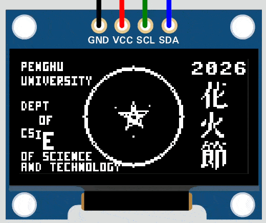

# Task 2A: ESP32 MicroPython OLED 炸裂動畫

## 目標
在 Wokwi 中使用 ESP32 + SSD1306 OLED，完成動態圖文動畫：
- 龍珠中央五芒星旋轉與呼吸放大縮小
- `花火節` 直排霓虹輪閃
- `CSIE` 字樣波浪舞（依序變大、變小，並上下彈跳）



## 專案位置
請使用本題資料夾：

`Weeks/Week-13/in-class/task2a/`

目前主要檔案：
- `main.py`
- `diagram.json`
- `wokwi.toml`
- `Makefile`
- `make.bat`（Windows 用）

## 任務要求
1. 開啟本題 Wokwi 專案。
2. 了解 `main.py` 中 I2C、OLED 與動畫迴圈的流程。
3. 確認畫面包含：
- 外圓龍珠與旋轉五芒星
- 左側英文小字資訊
- `CSIE` 波浪舞動畫
- 右上角 `2026`
- `2026` 下方直排 `花火節` 輪閃動畫
4. 觀察以下動畫參數對節奏與效果的影響：
- 星星角速度（`angle` 更新率）
- `time.sleep(...)` 幀率
- `shrink`、`spacing`、正弦波相位與幅度

## 執行方式
在 `task2a` 目錄內執行：

macOS / Linux:
```bash
make run
```

Windows:
```bat
make.bat run
```

可選擇指定 RFC2217 Port（預設 `4000`）：

```bash
make run 4001
```

```bat
make.bat run 4001
```

## 程式重點
- I2C 腳位：`scl=22`、`sda=21`
- OLED 尺寸：`128x64`
- 動畫主迴圈：`while True` + `render_frame(frame_idx)`
- 星星動畫：
- `draw_rotating_star(...)` 雙層反向旋轉
- `draw_orbit_sparks(...)` 外圈火花
- 呼吸效果由 `sin(...)` 控制星星尺寸
- 英文動畫：
- `draw_tiny_text_wave(...)` 讓 `CSIE` 逐字縮放與上下位移
- 中文動畫：
- `framebuf.FrameBuffer(...)` 載入 32x32 字點陣
- `draw_text_vertical_flash(...)` 直排逐字閃爍

## 驗收標準
- 程式可透過 `make` 或 `make.bat` 正常執行。
- Wokwi 模擬中可連續播放動畫，且畫面不卡死。
- 中央五芒星有旋轉與呼吸感。
- `花火節` 三字在 `2026` 下方直排閃爍。
- `CSIE` 四字呈現波浪舞效果。
