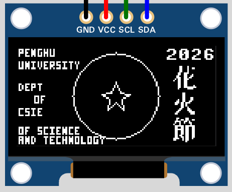

# Task 2: ESP32 MicroPython OLED 圖文排版

## 目標
在 Wokwi 中使用 ESP32 + SSD1306 OLED，完成以下顯示內容：
- 圓形與星形圖案
- 英文小字資訊（學校與系名）
- 年份 `2026`
- 直排縮小中文字 `花火節`



## 專案位置
請使用本題資料夾：

`Weeks/Week-13/in-class/task2/`

目前主要檔案：
- `main.py`
- `diagram.json`
- `wokwi.toml`
- `Makefile`
- `make.bat`（Windows 用）

## 任務要求
1. 開啟本題 Wokwi 專案。
2. 了解 `main.py` 中 I2C 與 OLED 初始化流程。
3. 確認畫面包含：
- 圓形外框與中心星形
- 左側英文資訊文字
- 右上角 `2026`
- `2026` 下方直排 `花火節`
4. 觀察中文字縮放參數（`shrink`）對字體大小的影響。

## 執行方式
在 `task2` 目錄內執行：

macOS / Linux:
```bash
make run
```

Windows:
```bat
make.bat run
```

可選擇指定 RFC2217 Port（預設 `4000`）：

```bash
make run 4001
```

```bat
make.bat run 4001
```

## 程式重點
- I2C 腳位：`scl=22`、`sda=21`
- OLED 尺寸：`128x64`
- 圖形：
- `draw_circle(...)` 繪製外圓
- `draw_star(...)` 繪製中心星形
- 英文小字：`draw_tiny_text(...)`（3x5 點陣）
- 中文字：
- 透過 `framebuf.FrameBuffer(...)` 載入 32x32 點陣
- 使用 `shrink` 參數縮小後顯示
- 透過 `draw_text_vertical(...)` 由上到下直排

## 驗收標準
- 程式可透過 `make` 或 `make.bat` 正常執行。
- Wokwi 模擬中 OLED 成功顯示圖形與文字。
- `花火節` 以直排方式出現在 `2026` 下方。
- `main.py` 與接線設定一致。
